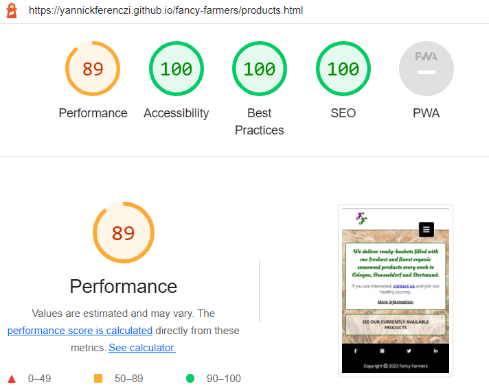

# Fancy Farmers Website
(Developer: Yannick Ferenczi)

This is the marketing website to promote the Fancy Farmers company. It provides information about the Fancy Farmers, their products, their events and how to find them and contact them. It is a fully responsive website allowing customers to visit it from any device.
Fancy Farmers is a farm company bio certified, located in nrw, Germany.

[Visit the live project here](https://yannickferenczi.github.io/fancy-farmers/index.html)

<h2>Table of Contents</h2>
<ol>
    <li><a href="#user-experience">User experience</a></li>
    <li><a href="#design">Design</a></li>
    <li><a href="#technologies-used">Technologies Used</a></li>
    <li><a href="#testing">Testing</a></li>
    <li><a href="#bugs">Bugs</a></li>
    <li><a href="#deployment">Deployment</a></li>
    <li><a href="#credits">Credits</a></li>
    <li><a href="#acknowledgements">Acknowledgements</a></li>
</ol>

<h2 id="user-experience">User Experience (UX)</h2>

<strong>Target Audience</strong>

The target audience for the Fancy Farmers can include:
<ol>
    <li>Health-conscious individuals who prioritize the quality and nutritional value of the food they consume and are willing to pay a premium for organic, locally-sourced produce.</li>
    <li>Environmentally-conscious consumers who are interested in reducing their carbon footprint and supporting sustainable farming practices.</li>
    <li>Individuals and families who live in or near Cologne, Dusseldorf, or Dortmund and are looking for a convenient way to purchase fresh, organic produce without having to travel long distances.</li>
    <li>Individuals who enjoy attending farm events and learning more about where their food comes from and how it is grown.</li>
    <li>Restaurants and cafes in the area that are looking for high-quality, locally-sourced ingredients for their dishes.</li>
</ol>

<strong>User stories</strong>

<ul>
    <li>
        First Time Visitor Goals
        <ol>
            <li>As a First Time Visitor, I want to easily understand the main purpose of the website and learn more about the organisation.
            </li>
            <li>As a First Time Visitor, I want to be able to easily navigate throughout the site to find content.
            </li>
            <li>As a First Time Visitor, I want to easily find where the farm is located to know if I can easily go there.
            </li>
            <li>As a First Time Visitor, I want to easily find the prices of their products and events.
            </li>
            <li>As a First Time Visitor, I want to easily find their organisation on social media to see how active they are and found feedback from current customers.
            </li>
        </ol>
    </li>
    <li>
        Returning Visitor Goals
        <ol>
            <li>As a Returning Visitor, I want to find the seasonnal products I want to purchase currently.
            </li>
            <li>As a Returning Visitor, I want to find the up coming events organised at the farm.
            </li>
            <li>As a Returning Visitor, I want to easily find a few different ways to contact the organisation.
            </li>
            <li>As a Returning Visitor, I want to find links to their social media.
            </li>
        </ol>
    </li>
    <li>
        Frequent User Goals
        <ol>
            <li>As a Frequent User, I want to know their currently available products.
            </li>
            <li>As a Frequent User, I want to know what are the up coming events organised at the farm.
            </li>
        </ol>
    </li>
</ul>

<h2 id="design">Design</h2>

<strong>Design orientation</strong>

The Website has been designed to communicate the feeling of nature and peace while the first goal is to show the user the proximity of the farm and how easy it is to have fresh and healthy products every week.

<strong>Colours</strong>

Regarding the colours, a darkgreen and a violet have been used for the logo to associate the nature with the quality. In fact, the green brings Harmony, refreshment, environmental awareness and peace and the violet brings Spiritual awareness, luxury, authenticity and quality.
Those two colours, combined with the yellow create a triadic colour, in which the yellow brings the energy.

As they are all three strong colours, the green and the violet have only been used with little touch to always refer to the logo, while the intensity of the yellow, used as a background color with an image, has been reduce with the transparency property to keep the overall balance a nice harmony.

Finally, a cover picture with a big blue sky has been used on the landing page to place the user into a calm and seren mood.

Because those colours are very strong and have a strong contrast together some black and white have been used to separate those colours and therefore use the full power of their association.

<strong>Fonts</strong>

Oleo Script Swash Caps has been used for the logo to communicate our elegance and break down some stereotypes associated to farmers. It has also been used for the headings to keep a certain consistency through the website. Cursive has been use as a fallback.

For the rest of the content, the more readable Open Sans has been used with a sans-serif as fallback. Open Sans has been used because it was a good recommendation to associate it to the Oleo Script Swash Caps font.

<strong>Structure</strong>

A common structure is used over all pages and contains a Header, with the logo and the menu, and a Footer, with the copyright and the social media links.
The website has 5 pages accessible from the menu:
<ul>
    <li>A landing page with the purpose of the company, their contact details and location</li>
    <li>An about page to present the family business and their certifications</li>
    <li>A products page to list the available products, their price and promote them</li>
    <li>An events page to display the up coming events with their price and describe them</li>
    <li>A contact page with a form to provide the user with an easy way to contact the company</li>
</ul>
The website also provide a thanks page only accessible after submiting the form.
  

<strong>Features</strong>

<ul>
    <li>The website has a favicon to help the user find easily the website back, even after opening an external link (which would open in a new tab).</li>
    <li>The website has an evolutive title to help the user know which page is currently open, even from another tab of the browser.</li>
    <li>The website has a responsive logo on every page to vehicle the identity of the company in every size.</li>
    <li>The website has a responsive menu on every page displayed inline on bigger screens and under a hamburger icon on smaller screens.</li>
    <li>The website has a social media section on every page to give the user the opportunity to connect with our community.</li>
    <li>The main page of the website has a background image representing the family farm of Fancy Farmers.</li>
    <li>On the products page, the user can click on a button to display the list and prices of products currently available.</li>
    <li>From the products page, the user can click on an internal link leading to the contact form.</li>
    <li>The products page also describes and promotes the products of the farm.</li>
    <li>The events page describe the upcoming events and integrates internal links as well for the user to go straight away to the contact form if they wish to book one of them.</li>
    <li>The contact page has been implemented in such a way that the user can either ask for more information or book a spot to one of our events or even create their basket with fresh products to be delivered.</li>
    <li>The landing page as well as the contact page display the address and phone number of the company to give all chances to the user to be in touch if wanted.</li>
</ul>

<strong>Wireframes</strong>

<ul>
    <li>The landing page, index.html, on desltop and mobile:
    </li>
    <li>The about page, about.html, on desltop and mobile:
    </li>
    <li>The products page, products.html, on desltop and mobile:
    </li>
    <li>The events page, events.html, on desltop and mobile:
    </li>
    <li>The contact page, contact.html, on desltop and mobile:
    </li>
</ul>

<h2 id="technologies-used">Technologies Used</h2>
<strong>Languages</strong>
<ul>
    <li>HTML5</li>
    <li>CSS3</li>
</ul>

<strong>Frameworks and other Programs</strong>
<ul>
    <li><a href="https://app.corelvector.com/ target="_blank">Corel Vector</a> has been used for the wireframes and the favicon.</li>
    <li><a href="https://fontawesome.com/" target="_blank">Font Awesome</a> has been used to display icons.</li>
    <li>Git has been used to version control the project.</li>
    <li>GitHub has been used to cloudify and deploy the project.</li>
    <li>GitPod has been used as an IDE to develop the project.</li>
    <li><a href="https://fonts.google.com/">Google Fonts</a> was used to import the needed font-families.</li>
</ul>

<h2 id="testing">Testing</h2>
<strong>Validator Testing for syntaxe errors</strong>

The W3C Markup Validator and W3C CSS Validator Services were used to validate every page of the project to ensure there were no syntax errors in the project.
The file base.css has been imported in all of the following tested css file. The result of the W3C CSS Validator for that file is shown below:   
<ol>
    <li>Landing page
        <ul>
            <li><a href="https://validator.w3.org/nu/?doc=https%3A%2F%2Fyannickferenczi.github.io%2Ffancy-farmers%2Findex.html" target="_blank">W3C Markup Validator - Results</a></li>
            <li><a href="https://jigsaw.w3.org/css-validator/validator?uri=https%3A%2F%2Fyannickferenczi.github.io%2Ffancy-farmers%2Findex.html&profile=css3svg&usermedium=all&warning=1&vextwarning=&lang=en" target="_blank">W3C CSS Validator - Results</a></li>
        </ul>
    </li>
    <li>About us
        <ul>
            <li><a href="https://validator.w3.org/nu/?doc=https%3A%2F%2Fyannickferenczi.github.io%2Ffancy-farmers%2Fabout.html" target="_blank">W3C Markup Validator - Results</a></li>
            <li><a href="https://jigsaw.w3.org/css-validator/validator?uri=https%3A%2F%2Fyannickferenczi.github.io%2Ffancy-farmers%2Fabout.html&profile=css3svg&usermedium=all&warning=1&vextwarning=&lang=en" target="_blank">W3C CSS Validator - Results</a></li>
        </ul>
    </li>
    <li>Our products
        <ul>
            <li><a href="https://validator.w3.org/nu/?doc=https%3A%2F%2Fyannickferenczi.github.io%2Ffancy-farmers%2Fproducts.html" target="_blank">W3C Markup Validator - Results</a></li>
            <li><a href="https://jigsaw.w3.org/css-validator/validator?uri=https%3A%2F%2Fyannickferenczi.github.io%2Ffancy-farmers%2Fproducts.html&profile=css3svg&usermedium=all&warning=1&vextwarning=&lang=en" target="_blank">W3C CSS Validator - Results</a></li>
        </ul>
    </li>
    <li>Our events
        <ul>
            <li><a href="https://validator.w3.org/nu/?doc=https%3A%2F%2Fyannickferenczi.github.io%2Ffancy-farmers%2Fevents.html" target="_blank">W3C Markup Validator - Results</a></li>
            <li><a href="https://jigsaw.w3.org/css-validator/validator?uri=https%3A%2F%2Fyannickferenczi.github.io%2Ffancy-farmers%2Fevents.html&profile=css3svg&usermedium=all&warning=1&vextwarning=&lang=en" target="_blank">W3C CSS Validator - Results</a></li>
        </ul>
    </li>
    <li>Contact us
        <ul>
            <li><a href="https://validator.w3.org/nu/?doc=https%3A%2F%2Fyannickferenczi.github.io%2Ffancy-farmers%2Fcontact.html" target="_blank">W3C Markup Validator - Results</a></li>
            <li><a href="https://jigsaw.w3.org/css-validator/validator?uri=https%3A%2F%2Fyannickferenczi.github.io%2Ffancy-farmers%2Fcontact.html&profile=css3svg&usermedium=all&warning=1&vextwarning=&lang=en" target="_blank">W3C CSS Validator - Results</a></li>
        </ul>
    </li>
    <li>Thanks
        <ul>
            <li><a href="https://validator.w3.org/nu/?showsource=yes&doc=https%3A%2F%2Fyannickferenczi.github.io%2Ffancy-farmers%2Fthanks.html" target="_blank">W3C Markup Validator - Results</a></li>
            <li><a href="https://jigsaw.w3.org/css-validator/validator?uri=https%3A%2F%2Fyannickferenczi.github.io%2Ffancy-farmers%2Fthanks.html&profile=css3svg&usermedium=all&warning=1&vextwarning=&lang=en" target="_blank">W3C CSS Validator - Results</a></li>
        </ul>
    </li>
</ol>
At last, all html and css file have returned 'no errors or warnings to show'. But it has not shown directly that result.
  
I wanted to add a hamburger menu to the navigation of the website without knowing that it was actually more a JavaScript thing.
But because I did not want to give up on that feature, I have managed to find a way to make it work with css only. Nevertheless, nesting a label tag inside a list element created an error when checking the HTML code. To fix that issue, I simply replaced the ul and li elements with some div elements keeping the same parent-children relationship.
  
Another error I encountered has been related to the iframe element I inserted from google maps on the landing page. I wanted the map to be responsive and therefore replaced the value of attributes height and width with some percentages. This practice generated an error on the validator. To fix it I just put back some digits only. The map was not responsive anymore but it did not seem to be a problem. If it would be, an easy way to fix it might be to use a few iframes with different dimensions and display them regarding the size of the screen.
  
I also had some issue while using the section element. It did not generate errors but some warnings. The origin of that issue was that the section elements should only be used with headings nested inside them. It was not always my case and when it was, the headings were not direct children but nested inside a div element, itself nested inside the section elements. To get rid of those warnings, I just replaced the section elements with some div elements.
  

<strong>lighthouse testing for accessibility & performance</strong>
<ol>
    <li>Landing page
        <ul>
            <li>
                

                    
See desktop result

                    
                

            </li>
            <li>
                

                    
See mobile result

                    
                

            </li>
        </ul>
    </li>
    <li>About us
        <ul>
            <li>
                

                    
See desktop result

                    
                

            </li>
            <li>
                

                    
See mobile result

                    
                

            </li>
        </ul>
    </li>
    <li>Our products
        <ul>
            <li>
                

                    
See desktop result

                    
                

            </li>
            <li>
                

                    
See mobile result

                    
                

            </li>
        </ul>
    </li>
    <li>Our events
        <ul>
            <li>
                

                    
See desktop result

                    
                

            </li>
            <li>
                

                    
See mobile result

                    
                

            </li>
        </ul>
    </li>
    <li>Contact us
        <ul>
            <li>
                

                    
See desktop result

                    
                

            </li>
            <li>
                

                    
See mobile result

                    
                

            </li>
        </ul>
    </li>
    <li>Thanks
        <ul>
            <li>
                

                    
See desktop result

                    
                

            </li>
            <li>
                

                    
See mobile result

                    
                

            </li>
        </ul>
    </li>
</ol>

<strong>Testing the Features along with the User Stories from the User Experience section above</strong>

<ul>
    <li>
        First Time Visitor Goals
        <ol>
            <li>As a First Time Visitor, I want to easily understand the main purpose of the website and learn more about the organisation.
                <ul>
                    <li>The landing page is clean and sober with only a few information. It gives a light feeling and allow users to quickly find the purpose of the Website: "Your organic products directly from our bio farm!"
                    </li>
                    <li>The about page comes straight next to the landing page on the menu, catching quickly the attention of users and inviting them to learn more about the organisation.
                    </li>
                </ul>
            </li>
            <li>As a First Time Visitor, I want to be able to easily navigate throughout the site to find content.
                <ul>
                    <li>Users can easily notice the navigation menu, as a bar on bigger screens and an expected hamburger icon on smaller screens, on every page of the website.
                    </li>
                    <li>Users can always know on which page they are with only a quick look at the navigation menu.
                    </li>
                    <li>The navigation menu, on any device, stick to the top allowing users to always have the ability to click to another page even if they have scrolled on the very bottom of a long page.
                    </li>
                </ul>
            </li>
            <li>As a First Time Visitor, I want to easily find where the farm is located to know if I can easily go there.
                <ul>
                    <li>Users can find a clickable map with the location of the farm directly on the landing page allowing them to open it in their navigation app and quickly know how far they are from the farm.
                    </li>
                    <li>Users can find the contact details of the farm on the landing page and on the contact page, with a clickable phone number allowing them to easily make a phone call to our customer service.
                    </li>
                </ul>
            </li>
            <li>As a First Time Visitor, I want to easily find the prices of their products and events.
                <ul>
                    <li>Users looking for products can easily go to the products page using the well described navigation menu.
                    </li>
                    <li>When landed on the right page, users can click on the "currently available products" call for action to display the list of products available and their prices.
                    </li>
                    <li>Users looking for events can easily go to the events page using the well described navigation menu.
                    </li>
                    <li>From the events page, prices and date of events are clearly displayed.
                    </li>
                </ul>
            </li>
            <li>As a First Time Visitor, I want to easily find their organisation on social media to see how active they are and found feedback from current customers.
                <ul>
                    <li>Users can find the social media links, each identified with their recognizable logo, on the bottom of every page.
                    </li>
                    <li>The links of the social media open in new tabs and does not disconnect users from the current website.
                    </li>
                </ul>
            </li>
        </ol>
    </li>
    <li>
        Returning Visitor Goals
        <ol>
            <li>As a Returning Visitor, I want to find the seasonnal products I want to purchase currently.
            </li>
            <li>As a Returning Visitor, I want to find the up coming events organised at the farm.
            </li>
            <li>As a Returning Visitor, I want to easily find a few different ways to contact the organisation.
            </li>
            <li>As a Returning Visitor, I want to find links to their social media.
            </li>
        </ol>
    </li>
    <li>
        Frequent User Goals
        <ol>
            <li>As a Frequent User, I want to know their currently available products.
            </li>
            <li>As a Frequent User, I want to know what are the up coming events organised at the farm.
            </li>
        </ol>
    </li>
</ul>

<strong>Further testing for responsiveness and cross-browsers compatibility</strong>
<ul>
    <li>The Website has been tested on Google Chrome, Firefox, Edge and Safari browsers.</li>
    <li>The Website was viewed on a smartphone Android, iPhone, tablet Android, Lenovo desktop, MacBook.</li>
    <li>All links have been tested and work perfectly.</li>
</ul>

<h2 id="bugs">Known Bugs</h2>
<ul>
    <li>For some reasons, the pictures on the products and on the events pages have a small gap at the bottom which is not intended. I did not find how to fix it.</li>
    <li>On the form, the submit and reset input keep their css properties with the hover values while using a touch screens. I think a small screens first approach while coding the css file would be the best way to fix this issue.</li>
</ul>

<h2 id="deployment">Deployment</h2>
<strong>How this site was deployed</strong>
<ul>
    <li>
        In the GitHub repository, navigate to the Settings tab, then choose Pages from the left hand menu.
    </li>
    <li>
        From the source section drop-down menu, select the Master Branch and click on the 'save' button.
    </li>
    <li>
        Refresh the page after a few minute to display the link to the live webpage.
    </li>
    <li>
        Any changes pushed to the master branch will take effect on the live project.
    </li>
</ul>

[Visit the live project here](https://yannickferenczi.github.io/fancy-farmers/index.html)

<strong>How to clone the repository</strong>
<ul>
    <li>
        Go to the https://github.com/yannickferenczi/fancy-farmers repository on GitHub.
    </li>
    <li>
        Click the 'Code' button to the right of the screen, then click HTTPs and copy the link.
    </li>
    <li>
        Open a GitBash terminal and navigate to the directory where you want to locate the clone.
    </li>
    <li>
        On the command line, type "git clone" then paste in the copied url and press the Enter key to begin the clone process.
    </li>
</ul>

<h2 id="credits">Credits</h2>
<strong>Content</strong>
<ul>
    <li>
        Most of the content has been created using ChatGPT.
    </li>
    <li>
        The rest of the content was been written by the developer.
    </li>
</ul>

<strong>Code</strong>
<ul>
    <li>
        The hamburger menu, written in CSS only, has been inspired by <a href="https://blog.logrocket.com/create-responsive-mobile-menu-with-css-no-javascript/" target="_blank">this excellent code</a> and <a href="https://developer.mozilla.org/en-US/docs/Web/CSS/:checked" target="_blank">that one too</a>.
    </li>
    <li>
        The CSS code to format the images on <a href="https://yannickferenczi.github.io/fancy-farmers/our_products.html">Our products</a> and on <a href="https://yannickferenczi.github.io/fancy-farmers/our_events.html">Our events</a> come from <a href="https://www.w3schools.com/css/css3_images.asp">this page</a>.
    </li>
    <li>
     the <a href="https://github.com/Code-Institute-Solutions/SampleREADME#colour-scheme">Code-Institute-Solution/SampleREADME</a> has been used as a base to elaborate this README.md file.
    </li>
</ul>

<strong>Media</strong>
<ul>
    <li>
        The icons in the footer and on the <a href="https://yannickferenczi.github.io/fancy-farmers/about_us.html" target="_blank">About us</a> page were taken from <a href="https://fontawesome.com/" target="_blank">Font Awesome</a>.
    </li>
    <li>
        The fonts used were imported from <a href="https://fonts.google.com/">Google Fonts</a>.
    </li>
    <li>
        All images were downloaded for free from <a href="https://www.pexels.com/">Pexels</a>.
    </li>
</ul>

<h2 id="acknowledgements">Acknowledgements</h2>
<ul>
    <li>
        Thank you to my mentor <a href="https://github.com/akshatnitd" target="_blank">Akshat Garg</a> who provided me with some resources to assist me in this project.
    </li>
    <li>
        Thank you to <a href="https://codeinstitute.net/de/" target="_blank">Code Institute</a> for their program to become a full stack software developer allowing me to code this project after less than 3 weeks of learning.
    </li>
</ul>
